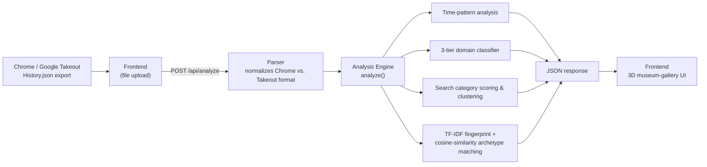

# Search Wrapped

*A self-contained C++ engine that turns your Chrome history into a data-driven personality profile.*

---

## Demo

screenshot/short GIF

---

## What It Does

Inspired by Spotfity's Spotify Wrapped, SearchWrapped is a self-contained web server that parses a Chrome (or Google Takeout) `History.json` export and analyzes it to show what you browse, when you browse it, and how your habits break down by category. It includes browsing patterns by time of day and category, a search-query fingerprint, and a personality archetype match — all computed server-side by a from-scratch C++ analysis engine, with no LLM calls and no external API dependency at runtime.
 
Two things distinguish it from a typical "wrapped"-style analytics script:
 
- **A three-tier domain classification cascade.** Every domain in a user's history is categorized by first checking a 505-domain public reference table, then falling back to a keyword scorer that runs the same scoring function across three different input types — search queries, hostname tokens, and aggregated page titles — before labeling anything left over as "Other".
- **A TF-IDF search fingerprint and cosine-similarity personality engine.** Search queries are tokenized, stop-word filtered, and scored with a TF-IDF metric that blends each user's own query against an embedded general-English frequency prior, surfacing the terms statistically unique to that person. Behavioral signals are then reduced to a 13-dimensional vector and matched via cosine similarity against 8 hand-tuned archetypes across 19 content categories, with a reported confidence percentage and runner-up "shadow" archetype.

---

## Tech Stack

C++17, cpp-httplib, nlohmann/json (backend, both header-only/no runtime deps), vanilla HTML/CSS/JS (frontend, no framework)

---

## Architecture

Data follows a straightforward pipeline: a history export goes in, is cleaned/standardized, is analyzed through 4 main methods, and comes back out as one JSON response that the frontend renders into the 3D gallery.
 

 

---

## The Categorization Cascade

Every site a user visited needs a category, but no single method can label all of them reliably — so Categorization happens in three steps, each one only running if the step before it comes up empty:
 
1. **Look it up.** Check the domain against a reference table of ~500 well-known sites (e.g. `amazon.com` → Shopping). A fast and accurate way to get the most popular domains categorized.
2. **Read the context.** If the domain isn't in that table, look at its name and the titles of the pages the user visited within that domain, and match that text against a list of category keywords. This is what lets the system correctly label sites the reference table has never heard of, such as a university course portal, a personal job-search page, and so on.
3. **Admit uncertainty.** If neither step finds a confident match, the domain is labeled "Other" instead of guessing.

With a 3-tiered categorization system, well-known sites get instant, reliable labels, obscure ones still get classified using real context, and anything more ambiguous is reported honestly rather than hidden behind a wrong answer.

---

## Data Provenance

how the public domain table was actually built — UT1 Blacklists (the maintained successor to the now-defunct Shallalist) cross-referenced against a DNSFilter/Webshrinker popularity ranking, with a documented data-cleaning step (excluding domains that cross-list into UT1's own gambling/malware/phishing categories, catching real contamination in the raw jobsearch list). 

---

## Search Fingerprinting & Personality Engine

 explains the TF-IDF engine (tokenization, stop-word filtering, TF blended with a corpus IDF and a general-English frequency prior) and the cosine-similarity archetype matcher (13-dimensional behavioral embedding compared against 8 hand-tuned archetype vectors, with match confidence % and a "shadow" second-place archetype). 

---

## Getting Started

clone → build (`make` / `start.sh`) → run → open browser instructions. 

---

## API Reference

a short table of endpoints — `POST /api/analyze`, `GET /api/demo`, `GET /api/health` —  with a one-line description and an example request/response shape

---

## Project Structure

short annotated file tree (`main.cpp`, `include/`, `scripts/`, `frontend/`, etc.) 

---

## Roadmap

2-4 forward-looking bullets on planned work. 
